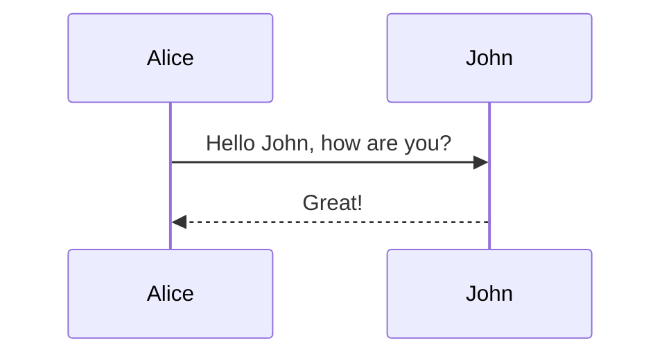
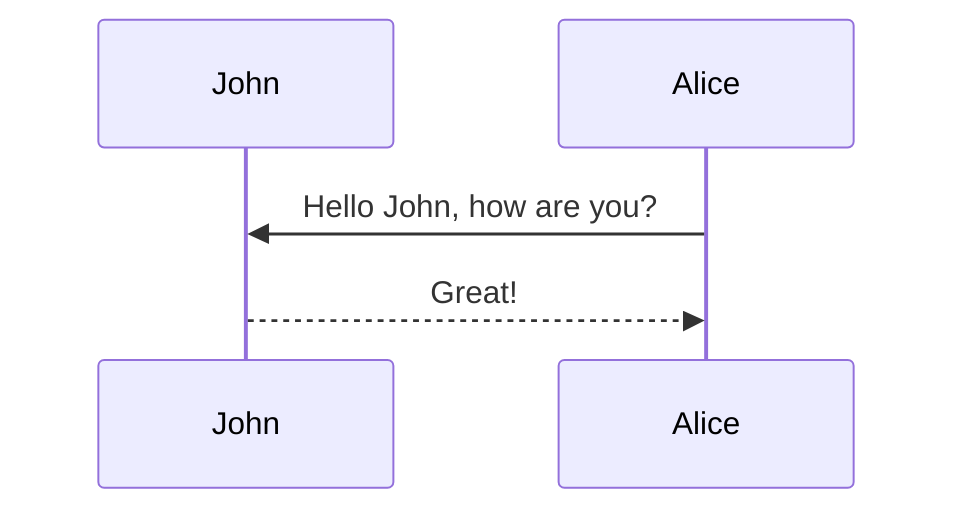
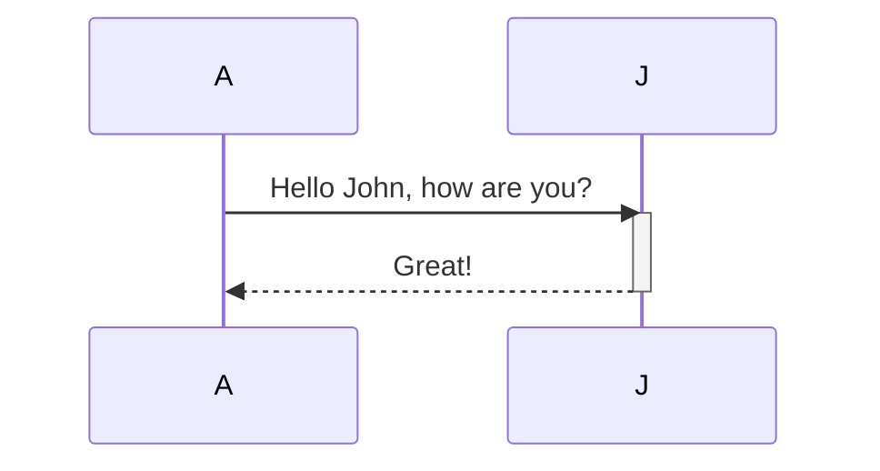
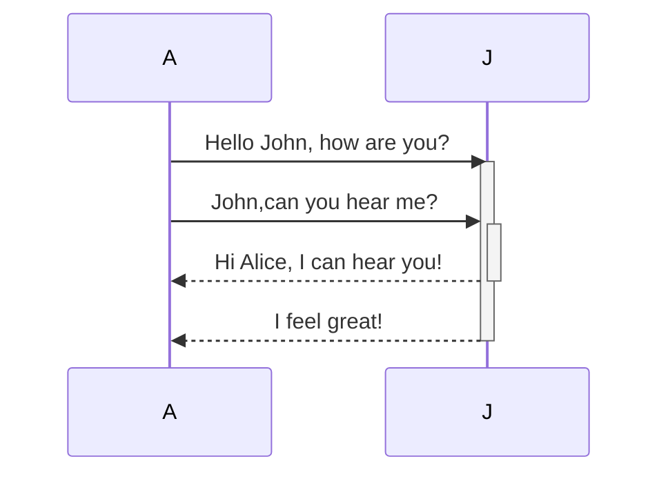
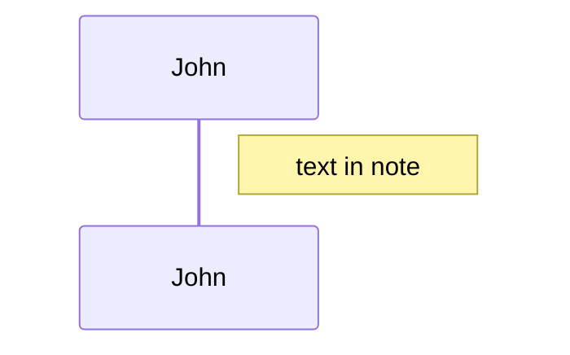
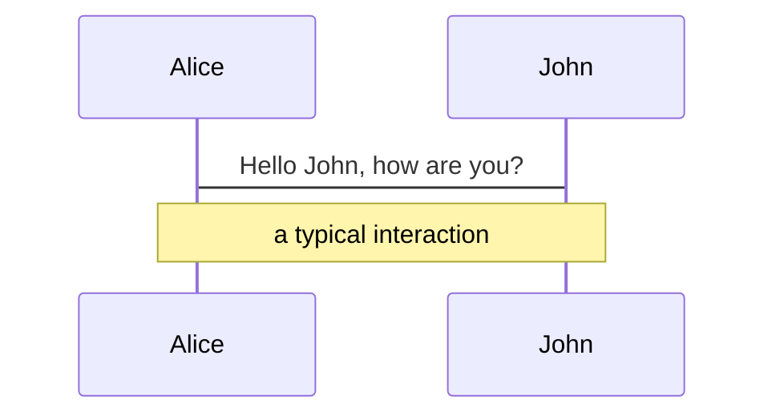
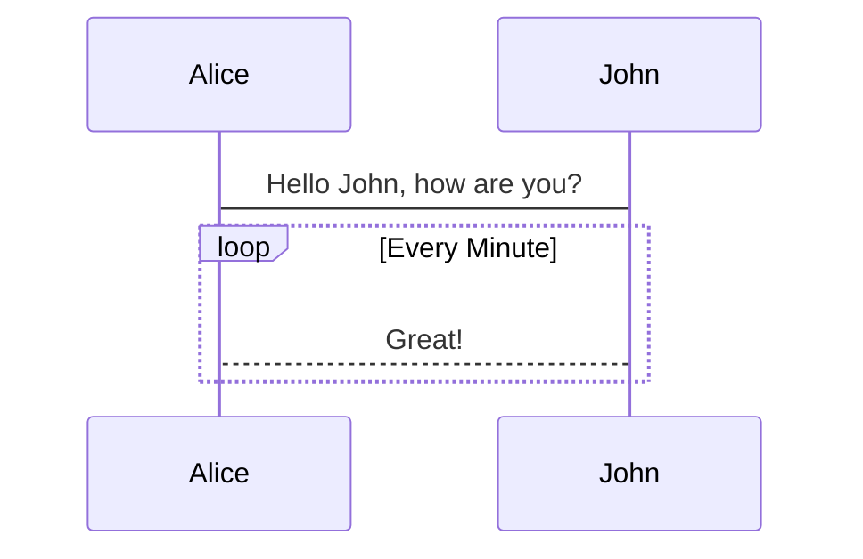
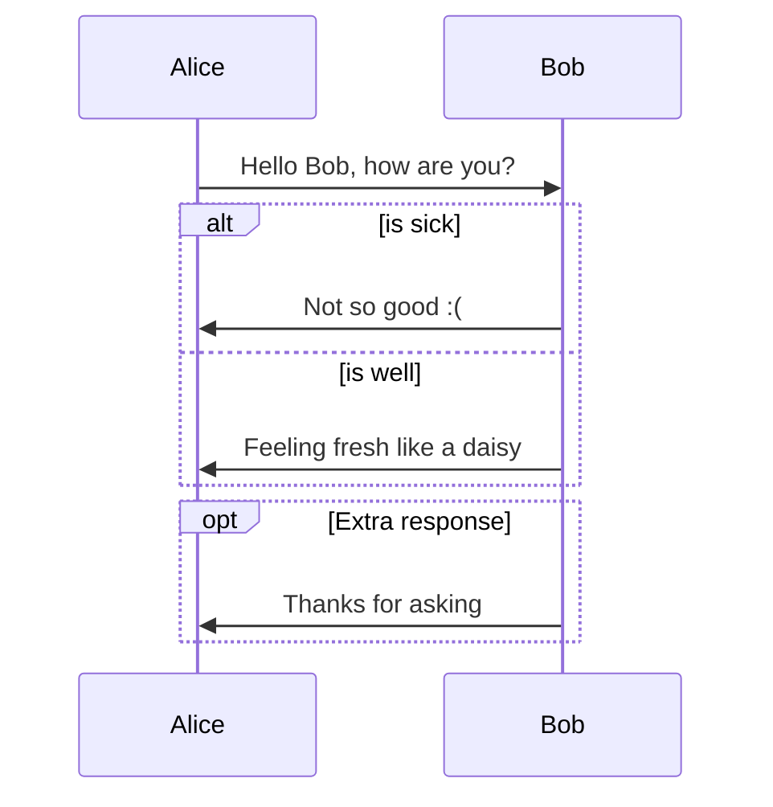

Typora操作文档
=======

# 用Markdown绘制图
Typora支持一些绘图的Markdown插件，你可以在**编辑**->**智能标点**->**更多选项**中启用该特性。

当以HTML，PDF，epub，docx格式导出时，这些格式会包含图，但是当以markdown格式导出到其他文件格式时，图将不会被导出。你应该也注意到图不被标准的Markdown工具所支持，例如CommonMark或GFM。因此我们依旧建议你插入图的图片而不是直接在Markdown编写它们。

## 时序图（Sequence diagram）

时序图是一个交互图，它展示了一个流程到另一个流程是按何种顺序进行操作的。

### 语法（Syntax）

**参与者（Participants）**

在上面的例子中，参与者可以被隐形定义。在隐形调用时，参与者或执行者会按照图源码的顺序进行渲染。有时候，你想以另一种顺序来展示上面的参与者。那你可以和下面的例子一样来指定参与者的顺序。

**别名（Aliases）**

参与者可以有一个很方便的标志符和一个描述性的标签。

**消息（Messages）**

两个参与者之间的消息可以以实现显示，也可以以虚线显示。

		[Actor][Arrow][Actor]:Message text

当前支持六种箭头形式

类型|描述
:-:|:-
->|没有箭头的实线
-->|没有箭头的虚线
->>|有箭头的实线
-->>|有箭头的虚线
-x|末端有十字架的实线（异步）
--x|末端有十字架的虚线（异步）

**激活（Activations）**

可以激活和停用参与者。激活与停用有专门的定义：

可以对同一个参与者进行多次激活：

**笔记（Notes）**

可以向时序图添加笔记，语法`Note [right of|left of|over] [Actor]:Text in note content`，示例如下：

也可以创建跨越两个参与者的笔记：

**循环（Loops）**

在时序图中可以通过以下符号来表达循环：

		loop Loop text
		... statemens ...
		end

示例如下：

**替代路径（Alt）**

在时序图中可以通过以下符号来表达替代路径：

		alt Describing text
		... statements ...
		else
		... statements ...
		end

或者有一个可选的序列（if语句没有else）：

		opt Describing text
		... statements ...
		end

示例如下：

